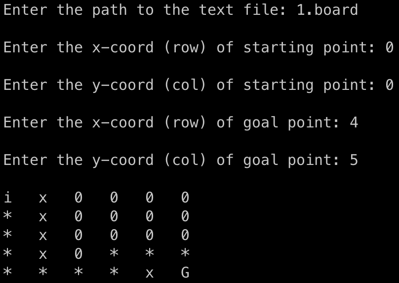

# A* Search Algorithm

The A* search algorithm is to find a path to the given goal node with the smallest cost.

> At each iteration of the algorithm, A\* determines which of its paths to extend. It does so based on the cost of the path and an estimate of the cost required to extend the path all the way to the goal. Specifically, A* selects the path that minimizes `f(n) = g(n) + h(n)` where `n` is the next node on the path, `g(n)` is the cost of the path from the starting node to `n`, and `h(n)` is a heuristic function that estimates the cost of the cheapest path from `n` to the goal. ([wikipedia](https://en.wikipedia.org/wiki/A*_search_algorithm))

## Files

```
.
|--- AStarSearchAlgorithm.hpp: the A* search algorithm
|--- test.cpp: algorithm testing examples
|--- main.cpp: main function to run the algorithm
|--- 1.board: text file of a rectangle grid
|--- makefile: compile scripts
```

## Usage  

1. One should provide a text file with a fixed format for each line, which is *a number followed by a comma* where the number are `0` or `1`. For example, `1,0,0,0,0,`. See [`1.board`](1.board) for more details.

2. Enter the starting and goal point: row and column (index starts from 0)

> Note: the starting point can be empty `0` or obstacle `1`.  

```shell
$ make build
$ ./a.out
```



> Note: `i` is the initial point, `0` is empty, `x` is obstacle, `*` is path, and `G` is goal.  

## Testing

I set up auto-testing for the algorithm itself which will run every time when pushing to the repo (see `Action` tab for more details). You can also test the algorithm locally with the following scripts:

```shell
$ make test
$ ./a.out
```

To delete the object file, run `make clean`.
